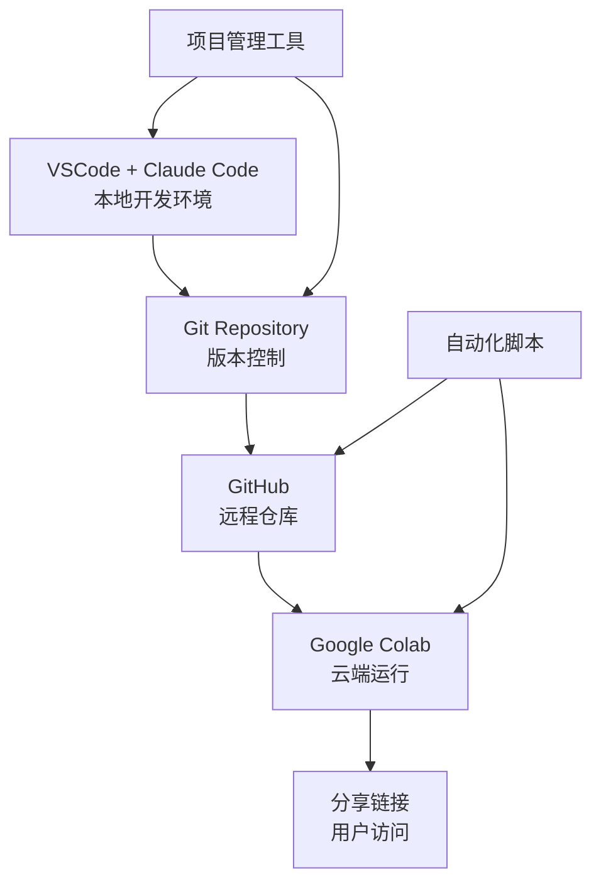

# Claude Code + Google Colab 集成指南

**版本**: 1.3.2  
**创建日期**: 2025-08-17  
**更新日期**: 2025-08-24
**作者**: Claude Code 团队  
**适用环境**: Windows WSL + VSCode + Claude Code + Google Colab

## 📋 目录

1. [概述](#概述)
2. [系统架构](#系统架构)
3. [项目组织策略](#项目组织策略)
4. [环境配置](#环境配置)
5. [工具和脚本](#工具和脚本)
6. [工作流程](#工作流程)
7. [最佳实践](#最佳实践)
8. [故障排除](#故障排除)
9. [附录](#附录)

## 概述

### 🎯 目标
建立一个高效的开发工作流，实现：
- **本地开发**: 使用VSCode + Claude Code进行代码开发
- **云端运行**: 利用Google Colab的免费GPU资源
- **便捷分享**: 通过简单链接分享项目演示
- **版本控制**: 集成Git和GitHub进行代码管理

### 🏗️ 核心优势
- ✅ **零成本GPU**: 利用Colab免费GPU资源
- ✅ **AI辅助开发**: Claude Code提供智能代码辅助
- ✅ **即时分享**: 一键生成可分享的演示链接
- ✅ **版本管理**: 完整的Git工作流支持
- ✅ **跨平台**: Windows/Linux/Mac通用方案

## 系统架构

### 🔄 数据流架构


### 🛠️ 技术栈
- **开发环境**: Windows WSL2 + Ubuntu
- **代码编辑**: VSCode + Claude Code Extension
- **版本控制**: Git + GitHub
- **云端计算**: Google Colab
- **自动化**: Python脚本 + Shell脚本

## 项目组织策略

### 🎭 混合管理模式

我们采用智能混合管理策略，根据项目特征自动选择最佳组织方式：

#### 📁 目录结构
```
claude-colab-projects/
├── demos/                          # 演示应用目录 (多小型应用架构)
│   ├── medical-ocr/               # 医疗OCR识别应用 (独立可运行)
│   │   ├── medical-ocr-demo.ipynb  # 主演示notebook
│   │   ├── gradio_demo.py          # Web界面版本
│   │   ├── test_chinese_encoding_fix.py  # 中文编码测试
│   │   ├── assets/                 # 应用专用资源
│   │   └── README.md              # 应用说明文档
│   ├── shared/                    # 共享资源和工具
│   │   ├── utils/                 # 通用工具函数
│   │   ├── fonts/                 # 共享字体文件
│   │   └── templates/             # 共享模板
│   ├── dev-tools/                 # 开发辅助工具 (非演示)
│   │   ├── generators/            # 文档生成器
│   │   └── legacy-tests/          # 历史测试脚本
│
├── standalone/                     # 独立管理的完整项目
│   ├── medplib-research/           # 医学AI研究项目
│   │   ├── medplib-demo.ipynb
│   │   ├── README.md
│   │   ├── requirements.txt
│   │   ├── models/
│   │   └── data/
│   ├── stock-analyzer/             # 股票分析系统
│   │   ├── analyzer.ipynb
│   │   ├── README.md
│   │   └── utils/
│   └── image-generator/            # 图像生成工具
│       ├── generator.ipynb
│       ├── README.md
│       └── assets/
│
├── templates/                      # 项目模板
│   ├── basic-demo-template.ipynb
│   ├── ai-project-template.ipynb
│   └── research-template/
│
├── shared/                         # 共享资源
│   ├── utils.py                   # 通用工具函数
│   ├── common-setup.ipynb         # 通用环境设置
│   └── assets/                    # 共享资源文件
│
├── tools/                          # 项目管理工具
│   ├── project_organizer.py       # 项目智能组织工具
│   └── sync_tool.py               # 同步工具
│
├── tests/                         # 测试目录
│   ├── unit/                      # 单元测试
│   │   └── test_local_ocr.py      # 本地OCR功能测试
│   ├── data/                      # 测试数据
│   └── README.md                  # 测试说明
│
├── .vscode/                       # VSCode配置
├── start_local.sh                 # 本地环境一键启动脚本
├── README_LOCAL.md                # 本地运行指南
├── claude-colab-integration-guide.md # 集成指南
├── SESSION_HANDOVER.md            # 对话交接文档
├── requirements-dev.txt           # 开发依赖
└── CLAUDE.md                      # 项目约定和配置
│
├── docs/                          # 文档
│   ├── best-practices.md
│   ├── troubleshooting.md
│   └── api-reference.md
│
├── projects.json                  # 项目元数据
├── README.md                      # 项目总览
└── .gitignore                     # Git忽略规则
```

#### 🤖 智能选择策略

| 项目特征 | 推荐策略 | 存放位置 | 文件组织 |
|----------|----------|----------|----------|
| 简单演示 (<100行) | 集中管理 | `demos/` | 单个notebook |
| 教学示例 | 集中管理 | `demos/` | 单个notebook |
| 快速原型 | 集中管理 | `demos/` | 单个notebook |
| 复杂项目 (>500行) | 独立管理 | `standalone/` | 完整目录结构 |
| 研究项目 | 独立管理 | `standalone/` | 完整目录结构 |
| 商业项目 | 独立管理 | `standalone/` | 完整目录结构 |

## 环境配置

### 🔧 系统要求
- Windows 10/11 with WSL2
- Ubuntu 20.04+ (WSL)
- Python 3.8+
- Git 2.30+
- VSCode with Claude Code extension

### 📦 依赖安装

#### 1. WSL环境准备
```bash
# 更新系统
sudo apt update && sudo apt upgrade -y

# 安装基础工具
sudo apt install -y git curl wget python3 python3-pip python3-venv

# 安装Node.js (用于某些工具)
curl -fsSL https://deb.nodesource.com/setup_18.x | sudo -E bash -
sudo apt-get install -y nodejs
```

#### 2. Python环境设置
```bash
# 创建专用虚拟环境
python3 -m venv ~/claude-colab-env
source ~/claude-colab-env/bin/activate

# 安装核心依赖
pip install --upgrade pip
pip install jupyter notebook ipython
pip install google-api-python-client google-auth-httplib2 google-auth-oauthlib
pip install GitPython
pip install requests beautifulsoup4
pip install typer rich
```

#### 3. Git配置
```bash
# 配置Git用户信息
git config --global user.name "Your Name"
git config --global user.email "your.email@example.com"

# 配置GitHub访问 (推荐使用SSH)
ssh-keygen -t ed25519 -C "your.email@example.com"
# 将公钥添加到GitHub账户
```

## 工具和脚本

### 🛠️ 核心工具集

#### 1. 项目智能组织工具 (`project_organizer.py`)
```python
#!/usr/bin/env python3
"""
Claude Code 项目智能组织工具
根据项目特征自动选择最佳管理策略
"""

import os
import json
from pathlib import Path
from typing import Literal, Dict, Any

class ProjectOrganizer:
    def __init__(self, base_dir: str = "~/claude-colab-projects"):
        self.base_dir = Path(base_dir).expanduser()
        self.structure = {
            'demos': self.base_dir / 'demos',
            'standalone': self.base_dir / 'standalone', 
            'templates': self.base_dir / 'templates',
            'shared': self.base_dir / 'shared',
            'tools': self.base_dir / 'tools',
            'docs': self.base_dir / 'docs'
        }
        
        # 确保目录存在
        for dir_path in self.structure.values():
            dir_path.mkdir(parents=True, exist_ok=True)
    
    def analyze_project(self, name: str, description: str = "") -> Dict[str, Any]:
        """分析项目特征并推荐组织方式"""
        
        # 关键词分析
        demo_keywords = ['demo', 'showcase', 'example', 'tutorial', 'quick', 'simple']
        complex_keywords = ['research', 'production', 'enterprise', 'full', 'complex', 'system']
        
        name_lower = name.lower()
        desc_lower = description.lower()
        
        is_demo = any(kw in name_lower or kw in desc_lower for kw in demo_keywords)
        is_complex = any(kw in name_lower or kw in desc_lower for kw in complex_keywords)
        
        # 推荐策略
        if is_demo and not is_complex:
            strategy = 'centralized'
            location = self.structure['demos']
            file_type = 'single_notebook'
        elif is_complex:
            strategy = 'standalone'
            location = self.structure['standalone'] / name
            file_type = 'project_directory'
        else:
            # 交互式选择
            strategy = self._interactive_choice(name)
            if strategy == 'centralized':
                location = self.structure['demos']
                file_type = 'single_notebook'
            else:
                location = self.structure['standalone'] / name
                file_type = 'project_directory'
        
        return {
            'name': name,
            'strategy': strategy,
            'location': location,
            'file_type': file_type,
            'is_demo': is_demo,
            'is_complex': is_complex
        }
    
    def _interactive_choice(self, name: str) -> str:
        """交互式选择项目组织方式"""
        print(f"\n🤔 项目 '{name}' 的组织方式选择:")
        print("1. 集中管理 - 适合简单演示，放在demos目录")
        print("2. 独立管理 - 适合复杂项目，独立目录和文档")
        
        while True:
            choice = input("请选择 (1/2): ").strip()
            if choice == '1':
                return 'centralized'
            elif choice == '2':
                return 'standalone'
            else:
                print("请输入 1 或 2")
    
    def create_project(self, name: str, description: str = "", template: str = "basic"):
        """根据分析结果创建项目"""
        analysis = self.analyze_project(name, description)
        
        print(f"\n📊 项目分析结果:")
        print(f"   策略: {analysis['strategy']}")
        print(f"   位置: {analysis['location']}")
        print(f"   类型: {analysis['file_type']}")
        
        if analysis['file_type'] == 'single_notebook':
            self._create_notebook_project(analysis, template)
        else:
            self._create_directory_project(analysis, template)
        
        # 保存项目元数据
        self._save_project_metadata(analysis)
        
        return analysis['location']
    
    def _create_notebook_project(self, analysis: Dict, template: str):
        """创建单文件notebook项目"""
        notebook_path = analysis['location'] / f"{analysis['name']}.ipynb"
        
        # 创建notebook内容
        content = self._get_notebook_template(analysis['name'], template)
        self._write_notebook(notebook_path, content)
        
        print(f"✅ 创建单文件项目: {notebook_path}")
    
    def _create_directory_project(self, analysis: Dict, template: str):
        """创建目录结构项目"""
        project_dir = analysis['location']
        project_dir.mkdir(parents=True, exist_ok=True)
        
        # 创建主notebook
        notebook_path = project_dir / f"{analysis['name']}.ipynb"
        content = self._get_notebook_template(analysis['name'], template)
        self._write_notebook(notebook_path, content)
        
        # 创建README
        readme_path = project_dir / "README.md"
        readme_content = self._get_readme_template(analysis['name'])
        readme_path.write_text(readme_content, encoding='utf-8')
        
        # 创建requirements.txt
        req_path = project_dir / "requirements.txt"
        requirements_content = self._get_requirements_template(template)
        req_path.write_text(requirements_content, encoding='utf-8')
        
        # 创建.gitignore
        gitignore_path = project_dir / ".gitignore"
        gitignore_content = self._get_gitignore_template()
        gitignore_path.write_text(gitignore_content, encoding='utf-8')
        
        # 初始化git
        os.chdir(project_dir)
        os.system("git init")
        os.system("git add .")
        os.system(f'git commit -m "Initial commit: {analysis["name"]}"')
        
        print(f"✅ 创建项目目录: {project_dir}")
    
    def list_projects(self):
        """列出所有项目"""
        print("\n📁 项目列表:")
        
        # 演示项目
        print("\n🎭 演示项目 (demos/):")
        demo_files = list(self.structure['demos'].glob("*.ipynb"))
        if demo_files:
            for nb in demo_files:
                print(f"   📓 {nb.stem}")
        else:
            print("   (暂无演示项目)")
        
        # 独立项目
        print("\n🏗️ 独立项目 (standalone/):")
        standalone_dirs = [d for d in self.structure['standalone'].iterdir() if d.is_dir()]
        if standalone_dirs:
            for proj_dir in standalone_dirs:
                print(f"   📁 {proj_dir.name}")
        else:
            print("   (暂无独立项目)")
    
    def get_colab_links(self, github_user: str, repo_name: str):
        """生成所有项目的Colab链接"""
        base_url = f"https://colab.research.google.com/github/{github_user}/{repo_name}/blob/main"
        
        print(f"\n🔗 Colab访问链接 ({github_user}/{repo_name}):")
        
        # 演示项目链接
        print("\n🎭 演示项目:")
        demo_files = list(self.structure['demos'].glob("*.ipynb"))
        if demo_files:
            for nb in demo_files:
                rel_path = nb.relative_to(self.base_dir)
                link = f"{base_url}/{rel_path}"
                print(f"   📓 {nb.stem}: {link}")
        else:
            print("   (暂无演示项目)")
        
        # 独立项目链接
        print("\n🏗️ 独立项目:")
        standalone_dirs = [d for d in self.structure['standalone'].iterdir() if d.is_dir()]
        if standalone_dirs:
            for proj_dir in standalone_dirs:
                for nb in proj_dir.glob("*.ipynb"):
                    rel_path = nb.relative_to(self.base_dir)
                    link = f"{base_url}/{rel_path}"
                    print(f"   📁 {proj_dir.name}: {link}")
        else:
            print("   (暂无独立项目)")
    
    def _get_notebook_template(self, name: str, template: str) -> str:
        """获取notebook模板内容"""
        if template == "ai_demo":
            return f'''"""
{name} - AI演示项目
使用Claude Code开发，Google Colab运行

项目功能：
- 演示AI模型应用
- 提供交互式界面
- 支持GPU加速运行

使用说明：
1. 运行所有代码块
2. 根据提示输入参数
3. 查看运行结果
"""

# ================================
# 环境检查和基础设置
# ================================

# 检查运行环境
def check_environment():
    """检查运行环境并显示系统信息"""
    print("🔍 检查运行环境...")
    
    # 检查是否在Colab环境
    try:
        import google.colab
        print("✅ 运行在Google Colab")
        in_colab = True
    except ImportError:
        print("ℹ️ 运行在本地环境")
        in_colab = False
    
    # 检查GPU
    try:
        import torch
        device = 'cuda' if torch.cuda.is_available() else 'cpu'
        print(f"✅ PyTorch版本: {{torch.__version__}}")
        print(f"✅ 计算设备: {{device}}")
        if device == 'cuda':
            print(f"✅ GPU型号: {{torch.cuda.get_device_name(0)}}")
            print(f"✅ GPU内存: {{torch.cuda.get_device_properties(0).total_memory / 1e9:.1f}} GB")
    except ImportError:
        print("❌ PyTorch未安装，请先安装PyTorch")
        if in_colab:
            print("💡 在Colab中运行: !pip install torch torchvision torchaudio")
    
    return in_colab

# 安装依赖
def install_dependencies():
    """根据环境安装必要的依赖包"""
    in_colab = check_environment()
    
    if in_colab:
        print("📦 安装Colab环境依赖...")
        # 在Colab中安装依赖
        import subprocess
        import sys
        
        packages = ['gradio', 'transformers', 'accelerate']
        for package in packages:
            try:
                __import__(package)
                print(f"✅ {{package}} 已安装")
            except ImportError:
                print(f"📥 安装 {{package}}...")
                subprocess.check_call([sys.executable, '-m', 'pip', 'install', package])
    else:
        print("ℹ️ 本地环境请确保已安装必要依赖")

# ================================
# 主要功能实现
# ================================

def main_function():
    """主要业务逻辑"""
    print(f"🚀 {{name}} 启动成功!")
    
    # 在这里实现你的主要功能
    # 示例代码：
    import torch
    
    # 创建示例张量
    x = torch.randn(3, 3)
    print(f"示例张量:\\n{{x}}")
    
    # 如果有GPU，移动到GPU
    if torch.cuda.is_available():
        x = x.cuda()
        print("✅ 张量已移动到GPU")
    
    return x

# ================================
# 交互式界面 (可选)
# ================================

def create_gradio_interface():
    """创建Gradio交互界面"""
    try:
        import gradio as gr
        
        def process_input(text_input):
            """处理用户输入"""
            result = f"处理结果: {{text_input}}"
            return result
        
        # 创建界面
        interface = gr.Interface(
            fn=process_input,
            inputs=gr.Textbox(label="输入文本", placeholder="请输入内容..."),
            outputs=gr.Textbox(label="输出结果"),
            title=f"{{name}}",
            description="使用Claude Code开发的AI演示项目"
        )
        
        return interface
    except ImportError:
        print("❌ Gradio未安装，跳过界面创建")
        return None

# ================================
# 程序入口
# ================================

if __name__ == "__main__":
    # 1. 环境检查
    check_environment()
    
    # 2. 安装依赖
    install_dependencies()
    
    # 3. 运行主要功能
    result = main_function()
    
    # 4. 创建交互界面（如果可用）
    interface = create_gradio_interface()
    if interface:
        print("🌐 启动Gradio界面...")
        interface.launch(share=True)
    
    print("✅ 项目运行完成!")
'''
        else:
            return f'''"""
{name}
Claude Code + Google Colab 项目

项目描述：
[在这里描述项目的功能和用途]

开发环境：
- 本地：VSCode + Claude Code
- 云端：Google Colab

使用说明：
1. 运行环境检查
2. 执行主要功能
3. 查看运行结果
"""

# ================================
# 基础配置
# ================================

import os
import sys
import warnings
warnings.filterwarnings("ignore")

# 检查运行环境
def check_environment():
    """检查运行环境"""
    try:
        import google.colab
        print("✅ 运行在Google Colab")
        return True
    except ImportError:
        print("ℹ️ 运行在本地环境")
        return False

# ================================
# 主要功能
# ================================

def main():
    """主要业务逻辑"""
    print(f"🚀 {{name}} 启动成功!")
    
    # 检查环境
    in_colab = check_environment()
    
    # 你的代码在这里
    print("💡 请在这里添加你的项目代码")
    
    return "运行完成"

# ================================
# 程序入口
# ================================

if __name__ == "__main__":
    result = main()
    print(f"结果: {{result}}")
'''
    
    def _get_readme_template(self, name: str) -> str:
        """获取README模板"""
        return f"""# {name}

> 使用Claude Code开发，Google Colab运行的项目

## 🎯 项目概述

[在这里描述项目的主要功能和用途]

## 🚀 快速开始

### 在Colab中运行
[](https://colab.research.google.com/github/YOUR_USERNAME/YOUR_REPO/blob/main/standalone/{name}/{name}.ipynb)

### 本地运行
```bash
# 克隆仓库
git clone https://github.com/YOUR_USERNAME/YOUR_REPO.git
cd YOUR_REPO/standalone/{name}

# 安装依赖
pip install -r requirements.txt

# 启动Jupyter
jupyter notebook {name}.ipynb
```

## 📋 功能特性

- ✅ 特性1：[描述功能1]
- ✅ 特性2：[描述功能2]
- ✅ 特性3：[描述功能3]

## 🛠️ 技术栈

- **开发环境**: VSCode + Claude Code
- **运行环境**: Google Colab / Jupyter Notebook
- **主要技术**: Python, [其他技术栈]

## 📖 使用说明

1. **环境准备**: 确保已安装Python 3.8+
2. **依赖安装**: 运行 `pip install -r requirements.txt`
3. **运行项目**: 在Colab中打开notebook或本地运行
4. **配置参数**: 根据需要修改配置参数
5. **查看结果**: 运行所有代码块查看结果

## 📁 项目结构

```
{name}/
├── {name}.ipynb          # 主要notebook文件
├── README.md            # 项目说明文档
├── requirements.txt     # Python依赖包
├── assets/             # 静态资源文件（如有）
├── data/               # 数据文件（如有）
└── utils/              # 工具函数（如有）
```

## 🔧 配置说明

### 环境变量
```bash
# 示例环境变量配置
export PROJECT_ENV=production
export DEBUG_MODE=false
```

### 参数配置
在notebook中修改以下参数：
```python
# 配置参数
CONFIG = {{
    'model_name': 'your-model',
    'batch_size': 32,
    'learning_rate': 0.001
}}
```

## 📊 性能与资源

- **推荐配置**: GPU (T4或更高)
- **内存需求**: 最少4GB，推荐8GB+
- **预期运行时间**: [估算运行时间]

## 🐛 常见问题

### Q: 运行时出现内存不足错误
A: 减少batch_size参数或使用GPU运行时

### Q: 模型加载失败
A: 检查网络连接，确保能访问模型仓库

### Q: 依赖安装失败
A: 尝试使用 `pip install --upgrade pip` 更新pip

## 🤝 贡献指南

1. Fork 本仓库
2. 创建特性分支 (`git checkout -b feature/AmazingFeature`)
3. 提交更改 (`git commit -m 'Add some AmazingFeature'`)
4. 推送到分支 (`git push origin feature/AmazingFeature`)
5. 开启 Pull Request

## 📄 许可证

本项目采用 MIT 许可证 - 查看 [LICENSE](LICENSE) 文件了解详情

## 🙏 致谢

- [Claude Code](https://claude.ai/code) - AI辅助开发
- [Google Colab](https://colab.research.google.com/) - 免费GPU资源
- [相关项目或库] - 相关依赖和灵感来源

## 📞 联系方式

- 项目作者：[你的姓名]
- 邮箱：[your.email@example.com]
- GitHub：[@your-username](https://github.com/your-username)

---

*使用 Claude Code + Google Colab 构建 🚀*
"""
    
    def _get_requirements_template(self, template: str) -> str:
        """获取requirements.txt模板"""
        if template == "ai_demo":
            return """# AI演示项目依赖
# 核心依赖
torch>=2.0.0
torchvision>=0.15.0
torchaudio>=2.0.0
transformers>=4.30.0
accelerate>=0.20.0

# 界面和交互
gradio>=3.35.0
jupyter>=1.0.0
ipython>=8.0.0

# 数据处理
numpy>=1.24.0
pandas>=2.0.0
matplotlib>=3.7.0
seaborn>=0.12.0
pillow>=9.5.0

# 工具库
requests>=2.30.0
tqdm>=4.65.0
python-dotenv>=1.0.0

# 可选：深度学习相关
# opencv-python>=4.8.0
# scikit-learn>=1.3.0
# scipy>=1.10.0
"""
        else:
            return """# 项目依赖包
# 基础依赖
jupyter>=1.0.0
ipython>=8.0.0
numpy>=1.24.0
pandas>=2.0.0
matplotlib>=3.7.0

# 根据项目需要添加其他依赖
# torch>=2.0.0
# transformers>=4.30.0
# gradio>=3.35.0
# requests>=2.30.0
"""
    
    def _get_gitignore_template(self) -> str:
        """获取.gitignore模板"""
        return """# Python
__pycache__/
*.py[cod]
*$py.class
*.so
.Python
build/
develop-eggs/
dist/
downloads/
eggs/
.eggs/
lib/
lib64/
parts/
sdist/
var/
wheels/
pip-wheel-metadata/
share/python-wheels/
*.egg-info/
.installed.cfg
*.egg
MANIFEST

# PyInstaller
*.manifest
*.spec

# Installer logs
pip-log.txt
pip-delete-this-directory.txt

# Unit test / coverage reports
htmlcov/
.tox/
.nox/
.coverage
.coverage.*
.cache
nosetests.xml
coverage.xml
*.cover
*.py,cover
.hypothesis/
.pytest_cache/

# Jupyter Notebook
.ipynb_checkpoints

# IPython
profile_default/
ipython_config.py

# pyenv
.python-version

# Environment variables
.env
.venv
env/
venv/
ENV/
env.bak/
venv.bak/

# IDE
.vscode/
.idea/
*.swp
*.swo

# OS
.DS_Store
.DS_Store?
._*
.Spotlight-V100
.Trashes
ehthumbs.db
Thumbs.db

# Project specific
data/
models/
logs/
outputs/
checkpoints/
*.pkl
*.pth
*.pt
*.h5
*.hdf5

# Large files (add specific patterns as needed)
*.zip
*.tar.gz
*.rar
"""
    
    def _write_notebook(self, path: Path, content: str):
        """写入notebook文件"""
        # 将内容按代码块分割
        code_blocks = []
        current_block = []
        
        for line in content.split('\n'):
            if line.strip() and line.startswith('# ===') and len(current_block) > 0:
                # 新的代码块开始
                code_blocks.append('\n'.join(current_block))
                current_block = [line]
            else:
                current_block.append(line)
        
        if current_block:
            code_blocks.append('\n'.join(current_block))
        
        # 创建notebook结构
        cells = []
        for i, block in enumerate(code_blocks):
            cell = {
                "cell_type": "code",
                "metadata": {},
                "source": block.split('\n'),
                "execution_count": None,
                "outputs": []
            }
            cells.append(cell)
        
        notebook = {
            "nbformat": 4,
            "nbformat_minor": 0,
            "metadata": {
                "colab": {
                    "name": path.name,
                    "provenance": [],
                    "collapsed_sections": []
                },
                "kernelspec": {
                    "name": "python3",
                    "display_name": "Python 3"
                },
                "language_info": {
                    "name": "python",
                    "version": "3.8.0"
                }
            },
            "cells": cells
        }
        
        with open(path, 'w', encoding='utf-8') as f:
            json.dump(notebook, f, indent=2, ensure_ascii=False)
    
    def _save_project_metadata(self, analysis: Dict):
        """保存项目元数据"""
        metadata_file = self.base_dir / "projects.json"
        
        # 读取现有数据
        if metadata_file.exists():
            with open(metadata_file, 'r', encoding='utf-8') as f:
                projects = json.load(f)
        else:
            projects = {}
        
        # 添加新项目
        import datetime
        projects[analysis['name']] = {
            'strategy': analysis['strategy'],
            'location': str(analysis['location']),
            'file_type': analysis['file_type'],
            'created_date': datetime.datetime.now().isoformat(),
            'is_demo': analysis['is_demo'],
            'is_complex': analysis['is_complex']
        }
        
        # 保存
        with open(metadata_file, 'w', encoding='utf-8') as f:
            json.dump(projects, f, indent=2, ensure_ascii=False)

def main():
    import argparse
    
    parser = argparse.ArgumentParser(description='Claude Code 项目智能组织工具')
    parser.add_argument('action', choices=['create', 'list', 'links'], help='操作类型')
    parser.add_argument('--name', help='项目名称')
    parser.add_argument('--desc', default='', help='项目描述')
    parser.add_argument('--template', default='basic', choices=['basic', 'ai_demo'], help='项目模板')
    parser.add_argument('--github', help='GitHub仓库 (username/repo)')
    
    args = parser.parse_args()
    
    organizer = ProjectOrganizer()
    
    if args.action == 'create':
        if not args.name:
            print("❌ 请提供项目名称: --name PROJECT_NAME")
            return
        location = organizer.create_project(args.name, args.desc, args.template)
        print(f"\n🎯 下一步:")
        print(f"   1. cd {location}")
        print(f"   2. 使用Claude Code编辑代码")
        print(f"   3. git push到GitHub")
        print(f"   4. 在Colab中运行")
        
    elif args.action == 'list':
        organizer.list_projects()
        
    elif args.action == 'links':
        if not args.github:
            print("❌ 请提供GitHub仓库: --github username/repo")
            return
        user, repo = args.github.split('/')
        organizer.get_colab_links(user, repo)

if __name__ == "__main__":
    main()
```

#### 2. 快速同步工具 (`sync_script.py`)
```python
#!/usr/bin/env python3
"""
Claude Code + Colab 快速同步脚本
简化的项目同步和部署工具
"""

import os
import subprocess
import argparse
from pathlib import Path

def run_command(cmd, check=True):
    """运行命令并处理错误"""
    print(f"🔧 执行: {cmd}")
    try:
        result = subprocess.run(cmd, shell=True, check=check, capture_output=True, text=True)
        if result.stdout:
            print(result.stdout)
        return True
    except subprocess.CalledProcessError as e:
        print(f"❌ 命令执行失败: {e}")
        if e.stderr:
            print(f"错误信息: {e.stderr}")
        return False

def sync_to_github(message="Update from Claude Code"):
    """同步到GitHub"""
    print("📤 同步到GitHub...")
    
    commands = [
        "git add .",
        f'git commit -m "{message}"',
        "git push"
    ]
    
    for cmd in commands:
        if not run_command(cmd):
            return False
    
    print("✅ GitHub同步完成!")
    return True

def generate_colab_links(github_repo):
    """生成Colab链接"""
    base_url = f"https://colab.research.google.com/github/{github_repo}/blob/main"
    
    print(f"\n🔗 Colab链接生成 ({github_repo}):")
    
    # 查找所有notebook文件
    notebooks = list(Path.cwd().glob("**/*.ipynb"))
    
    if not notebooks:
        print("❌ 未找到notebook文件")
        return
    
    for nb in notebooks:
        rel_path = nb.relative_to(Path.cwd())
        link = f"{base_url}/{rel_path}"
        print(f"📓 {nb.name}: {link}")

def main():
    parser = argparse.ArgumentParser(description='Claude Code + Colab 快速同步工具')
    parser.add_argument('action', choices=['sync', 'links', 'full'], help='操作类型')
    parser.add_argument('--message', '-m', default="Update from Claude Code", help='提交信息')
    parser.add_argument('--repo', '-r', help='GitHub仓库 (username/repo)')
    
    args = parser.parse_args()
    
    if args.action == 'sync':
        sync_to_github(args.message)
    
    elif args.action == 'links':
        if not args.repo:
            print("❌ 请提供GitHub仓库: --repo username/repo")
            return
        generate_colab_links(args.repo)
    
    elif args.action == 'full':
        if not args.repo:
            print("❌ 请提供GitHub仓库: --repo username/repo")
            return
        
        # 完整流程：同步 + 生成链接
        if sync_to_github(args.message):
            generate_colab_links(args.repo)

if __name__ == "__main__":
    main()
```

### 🔗 快捷命令设置

#### 添加到 `~/.bashrc` 或 `~/.zshrc`：
```bash
# Claude Code + Colab 工作流别名
export CLAUDE_COLAB_DIR="$HOME/claude-colab-projects"

# 项目管理
alias cc-create='python $CLAUDE_COLAB_DIR/tools/project_organizer.py create'
alias cc-list='python $CLAUDE_COLAB_DIR/tools/project_organizer.py list'
alias cc-links='python $CLAUDE_COLAB_DIR/tools/project_organizer.py links'

# 快速同步
alias cc-sync='python $CLAUDE_COLAB_DIR/tools/sync_script.py sync'
alias cc-full='python $CLAUDE_COLAB_DIR/tools/sync_script.py full'

# 导航
alias cc-go='cd $CLAUDE_COLAB_DIR'
alias cc-demos='cd $CLAUDE_COLAB_DIR/demos'
alias cc-projects='cd $CLAUDE_COLAB_DIR/standalone'

# 快速创建
alias cc-demo='cc-create --template ai_demo'
alias cc-new='cc-create --template basic'

# 虚拟环境
alias cc-env='source $HOME/claude-colab-env/bin/activate'
```

## 工作流程

### 🚀 标准工作流程

#### 1. 项目初始化
```bash
# 激活虚拟环境
cc-env

# 进入工作目录
cc-go

# 创建新项目（系统会自动分析并推荐组织方式）
cc-create --name "my-ai-demo" --desc "simple chatbot demonstration" --template ai_demo

# 或创建复杂项目
cc-create --name "advanced-research" --desc "complex medical AI research project" --template basic
```

#### 2. 本地开发
```bash
# 进入项目目录
cd standalone/my-project  # 或 cd demos/（如果是演示项目）

# 使用VSCode + Claude Code开发
code .

# 在VSCode中：
# 1. 编辑notebook文件
# 2. 使用Claude Code辅助编程
# 3. 本地测试功能
```

#### 3. 版本控制
```bash
# 提交更改
git add .
git commit -m "Add new features"

# 推送到GitHub（首次需要设置remote）
git remote add origin https://github.com/username/repo-name.git
git push -u origin main

# 后续更新使用快速同步
cc-sync -m "Update model parameters"
```

#### 4. Colab部署
```bash
# 生成Colab链接
cc-links --repo username/repo-name

# 或完整流程（同步+生成链接）
cc-full --repo username/repo-name -m "Ready for Colab demo"
```

#### 5. 分享和演示
将生成的Colab链接分享给用户：
```
https://colab.research.google.com/github/username/repo/blob/main/demos/my-ai-demo.ipynb
```

### 🔄 日常维护流程

#### 每日工作流
```bash
# 1. 激活环境
cc-env

# 2. 进入工作目录
cc-go

# 3. 查看项目状态
cc-list

# 4. 选择项目进行开发
cd standalone/current-project

# 5. 开发完成后快速同步
cc-sync -m "Daily updates"
```

#### 周期性维护
```bash
# 查看所有项目的Colab链接
cc-links --repo username/claude-projects

# 清理和整理项目
# (可以手动移动demos中的项目到standalone，或相反)

# 更新项目文档
# 编辑README.md文件，更新项目说明
```

## 最佳实践

### 📋 项目组织最佳实践

#### 1. 命名规范
```bash
# 演示项目命名（放在demos/）
quick-ai-chatbot.ipynb
simple-image-classifier.ipynb
data-visualization-demo.ipynb

# 独立项目命名（放在standalone/）
medical-diagnosis-system/
stock-market-analyzer/
natural-language-processor/
```

#### 2. 文档标准
每个项目都应包含：
- 清晰的项目描述
- 安装和使用说明
- 示例代码和结果
- 故障排除指南
- 联系方式

#### 3. 代码结构
```python
# 推荐的notebook结构
"""
1. 项目说明和概述
2. 环境检查和依赖安装
3. 数据加载和预处理
4. 模型定义和训练
5. 结果展示和可视化
6. 交互界面（如果有）
7. 总结和下一步
"""
```

### 🎯 性能优化

#### 1. Colab资源优化
```python
# 在notebook开头添加资源检查
def optimize_colab_resources():
    """优化Colab资源使用"""
    import gc
    import torch
    
    # 清理内存
    gc.collect()
    
    # 清理GPU缓存
    if torch.cuda.is_available():
        torch.cuda.empty_cache()
        print(f"GPU内存使用: {torch.cuda.memory_allocated()/1e9:.2f}GB")
    
    # 设置环境变量
    os.environ['TF_CPP_MIN_LOG_LEVEL'] = '2'  # 减少TensorFlow日志
```

#### 2. 模型加载优化
```python
# 使用缓存和检查点
def load_model_with_cache(model_name, cache_dir="./models"):
    """带缓存的模型加载"""
    cache_path = Path(cache_dir) / f"{model_name}.pt"
    
    if cache_path.exists():
        print(f"从缓存加载模型: {cache_path}")
        return torch.load(cache_path)
    else:
        print(f"下载模型: {model_name}")
        model = download_model(model_name)
        
        # 保存到缓存
        cache_path.parent.mkdir(exist_ok=True)
        torch.save(model, cache_path)
        return model
```

### 🔒 安全最佳实践

#### 1. 敏感信息管理
```python
# 使用环境变量存储API密钥
import os
from google.colab import userdata  # Colab专用

def get_api_key(key_name):
    """安全获取API密钥"""
    try:
        # 尝试从Colab Secrets获取
        return userdata.get(key_name)
    except:
        # 回退到环境变量
        return os.getenv(key_name)

# 使用方式
api_key = get_api_key('OPENAI_API_KEY')
```

#### 2. 数据隐私保护
```python
# 避免在notebook中硬编码敏感数据
# ❌ 错误做法
user_data = {'email': 'user@example.com', 'password': '123456'}

# ✅ 正确做法
user_data = {
    'email': os.getenv('USER_EMAIL', 'demo@example.com'),
    'password': os.getenv('USER_PASSWORD', 'demo_password')
}
```

### 🔧 Git工作流最佳实践

#### 1. 分支策略
```bash
# 主分支保持稳定
git checkout main

# 为新功能创建分支
git checkout -b feature/new-ai-model

# 开发完成后合并
git checkout main
git merge feature/new-ai-model
git branch -d feature/new-ai-model
```

#### 2. 提交信息规范
```bash
# 使用语义化提交信息
git commit -m "feat: add new image classification model"
git commit -m "fix: resolve GPU memory leak issue"
git commit -m "docs: update README with installation guide"
git commit -m "refactor: optimize model loading performance"
```

## 故障排除

### 🐛 常见问题解决

#### 1. 环境相关问题

**问题**: Python虚拟环境激活失败
```bash
# 解决方案
python3 -m venv ~/claude-colab-env --clear
source ~/claude-colab-env/bin/activate
pip install --upgrade pip
```

**问题**: Git推送权限错误
```bash
# 解决方案：设置SSH密钥
ssh-keygen -t ed25519 -C "your.email@example.com"
cat ~/.ssh/id_ed25519.pub
# 将公钥添加到GitHub SSH Keys设置
```

**问题**: WSL中浏览器无法打开
```bash
# 解决方案：配置WSL浏览器
export BROWSER="/mnt/c/Program Files/Google/Chrome/Application/chrome.exe"
# 或手动复制URL到Windows浏览器
```

#### 2. Colab相关问题

**问题**: GPU配额用完
```python
# 解决方案：优化代码以减少GPU使用
def check_gpu_availability():
    if not torch.cuda.is_available():
        print("⚠️ GPU不可用，切换到CPU模式")
        return 'cpu'
    
    # 检查GPU内存
    memory_free = torch.cuda.get_device_properties(0).total_memory - torch.cuda.memory_allocated(0)
    if memory_free < 1e9:  # 少于1GB
        torch.cuda.empty_cache()
    
    return 'cuda'
```

**问题**: 模型下载超时
```python
# 解决方案：添加重试机制
import time
import requests

def download_with_retry(url, max_retries=3):
    for i in range(max_retries):
        try:
            response = requests.get(url, timeout=30)
            return response
        except requests.RequestException as e:
            print(f"下载失败 (尝试 {i+1}/{max_retries}): {e}")
            if i < max_retries - 1:
                time.sleep(5)
    raise Exception("下载失败，已达到最大重试次数")
```

#### 3. 项目管理问题

**问题**: 项目类型分类错误
```bash
# 解决方案：手动移动项目
# 从demos移动到standalone
mv demos/complex-project.ipynb standalone/complex-project/
cd standalone/complex-project
cc-create --name complex-project --template basic  # 重新生成目录结构
```

**问题**: GitHub同步冲突
```bash
# 解决方案：处理合并冲突
git pull origin main
# 手动解决冲突后
git add .
git commit -m "Resolve merge conflicts"
git push
```

### 📊 性能监控

#### 1. 资源使用监控
```python
def monitor_resources():
    """监控系统资源使用"""
    import psutil
    import torch
    
    # CPU使用率
    cpu_percent = psutil.cpu_percent(interval=1)
    print(f"CPU使用率: {cpu_percent}%")
    
    # 内存使用
    memory = psutil.virtual_memory()
    print(f"内存使用: {memory.percent}% ({memory.used/1e9:.1f}GB/{memory.total/1e9:.1f}GB)")
    
    # GPU使用（如果可用）
    if torch.cuda.is_available():
        gpu_memory = torch.cuda.memory_allocated(0) / 1e9
        gpu_total = torch.cuda.get_device_properties(0).total_memory / 1e9
        print(f"GPU内存: {gpu_memory:.1f}GB/{gpu_total:.1f}GB")

# 在notebook中调用
monitor_resources()
```

#### 2. 性能基准测试
```python
import time
import functools

def benchmark(func):
    """性能基准测试装饰器"""
    @functools.wraps(func)
    def wrapper(*args, **kwargs):
        start_time = time.time()
        result = func(*args, **kwargs)
        end_time = time.time()
        print(f"{func.__name__} 执行时间: {end_time - start_time:.2f}秒")
        return result
    return wrapper

# 使用方式
@benchmark
def train_model():
    # 模型训练代码
    pass
```

## 附录

### 📚 参考资源

#### 官方文档
- [Google Colab官方文档](https://colab.research.google.com/notebooks/intro.ipynb)
- [GitHub Pages文档](https://docs.github.com/en/pages)
- [Jupyter Notebook文档](https://jupyter-notebook.readthedocs.io/)

#### 推荐学习资源
- [Colab最佳实践](https://colab.research.google.com/notebooks/intro.ipynb)
- [Git工作流指南](https://guides.github.com/introduction/flow/)
- [Python虚拟环境管理](https://docs.python.org/3/tutorial/venv.html)

### 🛠️ 工具扩展

#### 可选工具集成
```bash
# Jupyter扩展
pip install jupyter_contrib_nbextensions
jupyter contrib nbextension install --user

# 代码格式化
pip install black isort
pip install nbqa  # notebook代码格式化

# 文档生成
pip install sphinx
pip install jupyter-book  # 从notebook生成文档
```

#### 高级配置
```bash
# Jupyter配置
jupyter notebook --generate-config
# 编辑 ~/.jupyter/jupyter_notebook_config.py

# Git配置优化
git config --global core.autocrlf false  # WSL环境
git config --global init.defaultBranch main
git config --global pull.rebase false
```

### 📋 模板文件

#### `.gitignore` 模板
```gitignore
# 参见前面的 _get_gitignore_template() 函数内容
```

#### `requirements.txt` 模板
```txt
# 参见前面的 _get_requirements_template() 函数内容
```

#### GitHub Actions 工作流模板
```yaml
# .github/workflows/test-notebooks.yml
name: Test Notebooks

on:
  push:
    branches: [ main ]
  pull_request:
    branches: [ main ]

jobs:
  test:
    runs-on: ubuntu-latest
    
    steps:
    - uses: actions/checkout@v3
    
    - name: Set up Python
      uses: actions/setup-python@v4
      with:
        python-version: '3.8'
    
    - name: Install dependencies
      run: |
        python -m pip install --upgrade pip
        pip install jupyter nbconvert
        if [ -f requirements.txt ]; then pip install -r requirements.txt; fi
    
    - name: Test notebooks
      run: |
        find . -name "*.ipynb" -exec jupyter nbconvert --to notebook --execute {} \;
```

### 🎯 快速参考

#### 常用命令速查
```bash
# 项目管理
cc-create --name PROJECT_NAME --template TEMPLATE
cc-list
cc-links --repo USERNAME/REPO

# Git操作
cc-sync -m "COMMIT_MESSAGE"
cc-full --repo USERNAME/REPO

# 环境管理
cc-env                    # 激活虚拟环境
cc-go                     # 进入项目根目录
cc-demos                  # 进入演示目录
cc-projects               # 进入独立项目目录
```

#### 项目类型选择指南
```
选择集中管理 (demos/) 当:
- 代码少于100行
- 单一功能演示
- 不需要复杂依赖
- 临时测试代码

选择独立管理 (standalone/) 当:
- 代码超过500行
- 需要多个文件
- 复杂的项目结构
- 正式的产品或研究项目
```

---

**文档版本**: v1.3.2  
**最后更新**: 2025-08-24  
**维护者**: Claude Code 团队

*这份指南将随着工具和最佳实践的发展而持续更新。如有问题或建议，请提交Issue或Pull Request。*